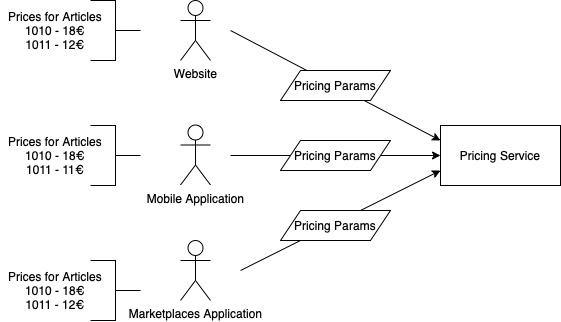

# Golang template

This template contains a list of questions that you can use to interview a QAA developer.

## How to use

1. Clone this repository
2. Create a new branch
3. Solve the interview questions
4. Open a pull request
5. Wait for the review

Or you may use your own repo, and give a link to Pull Request in it.

# TODO

1. Look at the image and try to imagine situation below.
   
   We have 3 different application, that display prices for products. 
   To check that prices displayed correctly we need to implement test case, 
   that will fetch the price from each of the clients, and compare results.
   This test case must have 2 articles for comparison: 1010 (pass) and 1011 (failed).
2. Application restrictions:
    - [ ] Use any programming language
    - [ ] Use interface to define client, so we may easily add new one, for example Desktop Application
    - [ ] Use mocks, or hardcoded array, to define reply of the client for price request
    - [ ] Use application layer separation (we don't want to change test case, if protocol of one of the client changes to HTTP for example)
    - [ ] Use SOLID [optional]
    - [ ] Create comparator interface, that can be injected to the test case (to reuse the check for different test cases) [optional]
    - [ ] Create an HTTP endpoint to run the test [optional]
3. Application should be able to:
    - [ ] Run the test case